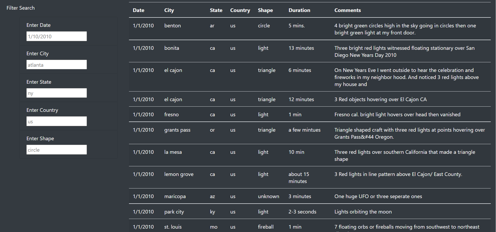

# UFOs

**Project Overview**

Th aim of this project is to create a tidy and easy to use HTML webpage that will have information about UFO sightings. To achieve that we needed to build a table using data stored in a JavaScript array. Then created filters to make this table fully dynamic, meaning that it reacts to user input, and then the table was placed into an HTML file for easy viewing.
The webpage was customized using Bootstrap, which helped to get the table with several fully functional filters that allows users to interact with it.

**Results**

UFO webpage visitors can use search criteria to view different results based on their preferences or what information they are trying to find. During the filtering process user can use all filters together or one or two.

Results by Using one filter, shape:

Results by Using tow filters, city and state:

Table without using any filter:

**Summary**

- One of the drawbacks of this webpage is how the filters works, which is by word input. If the user is not familiar enough with the topic and page content, it would make it hard to enter the right input. Another thing, this input is case sensitive, so if user add city name, for example, with capital letter , no results will show up as all cities in the table are in small letters.
- This drawback leads to a potential future development, as adding a drop menu for the filters, this way the users have list of options to choose from.
- The page can use some features to make it more user friendly such as a bottom to take you up the page, so you don't have to scroll all way up. Also, maybe sharing bottoms to different social media platform so user can easily share interesting finding with friends.
